# Bone-Fracture-Detection
## Introduction
 Since long ago, bone fractures was a long standing issue for mankind, and it's classification via x-ray has always depended on human diagnostics – which may be sometimes flawed.
In recent years, Machine learning and AI based solutions have become an integral part of our lives, in all aspects, as well as in the medical field.
In the scope of our research and project, we have been studying this issue of classification and have been trying, based on previous attempts and researches, to develop and fine tune a feasible solution for the medical field in terms of identification and classification of various bone fractures, using CNN ( Convolutional Neural Networks ) in the scope of modern models, such as ResNet, DenseNet, VGG16, and so forth.
After performing multiple model fine tuning attempts for various models, we have achieved classification results lower then the predefined threshold of confidence agreed upon later in this research, but with the promising results we did achieve, we believe that systems of this type, machine learning and deep learning based solutions for identification and classification of bone fractures, with further fine tuning and applications of more advanced techniques such as Feature Extraction, may replace the traditional methods currently employed in the medical field, with much better results.

## Dataset
The data set we used called MURA and included 3 different bone parts, MURA is a dataset of musculoskeletal radiographs and contains 20,335 images described below:

| **Part**     | **Normal** | **Fractured** | **Total** |
|--------------|:----------:|--------------:|----------:|
| **Elbow**    |    3160    |          2236 |      5396 |
| **Hand**     |    4330    |          1673 |      6003 |
| **Shoulder** |    4496    |          4440 |      8936 |

The data is separated into train and valid where each folder contains a folder of a patient and for each patient between 1-3 images for the same bone part

## Algorithm
Our data contains about 20,000 x-ray images, including three different types of bones - elbow, hand, and shoulder. After loading all the images into data frames and assigning a label to each image, we split our images into 72% training, 18% validation and 10% test. The algorithm starts with data augmentation and pre-processing the x-ray images, such as flip horizontal. The second step uses a ResNet50 neural network to classify the type of bone in the image. Once the bone type has been predicted, A specific model will be loaded for that bone type prediction from 3 different types that were each trained to identify a fracture in another bone type and used to detect whether the bone is fractured.
This approach utilizes the strong image classification capabilities of ResNet50 to identify the type of bone and then employs a specific model for each bone to determine if there is a fracture present. Utilizing this two-step process, the algorithm can efficiently and accurately analyze x-ray images, helping medical professionals diagnose patients quickly and accurately.
The algorithm can determine whether the prediction should be considered a positive result, indicating that a bone fracture is present, or a negative result, indicating that no bone fracture is present. The results of the bone type classification and bone fracture detection will be displayed to the user in the application, allowing for easy interpretation.
This algorithm has the potential to greatly aid medical professionals in detecting bone fractures and improving patient diagnosis and treatment. Its efficient and accurate analysis of x-ray images can speed up the diagnosis process and help patients receive appropriate care.

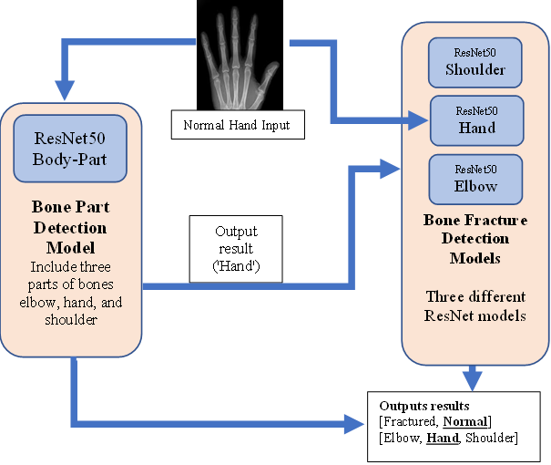

## Results
### Body Part Prediction

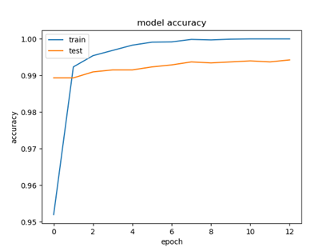 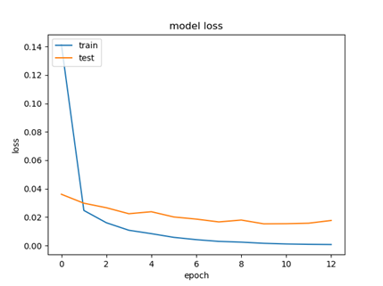

### Fracture Prediction
#### Elbow

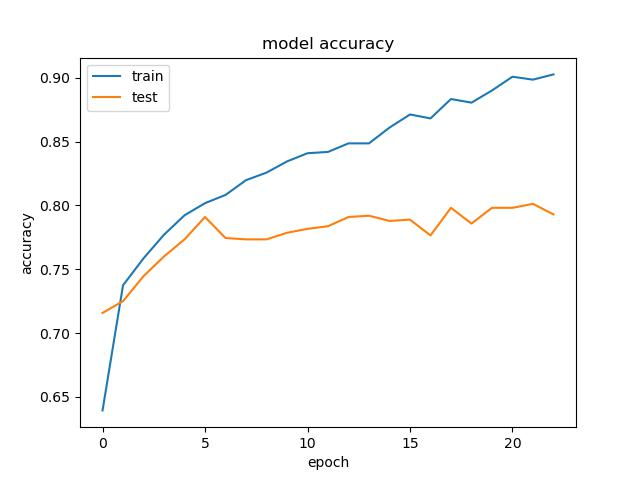 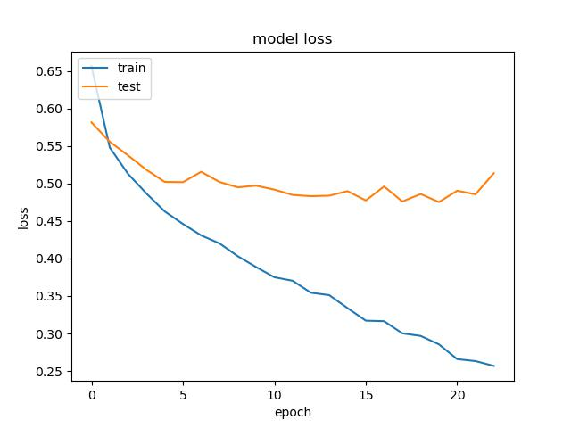

#### Hand
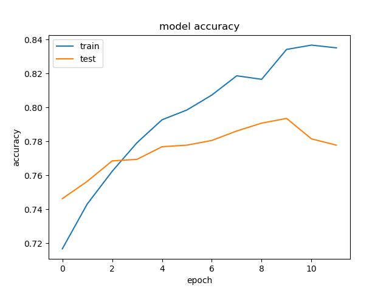 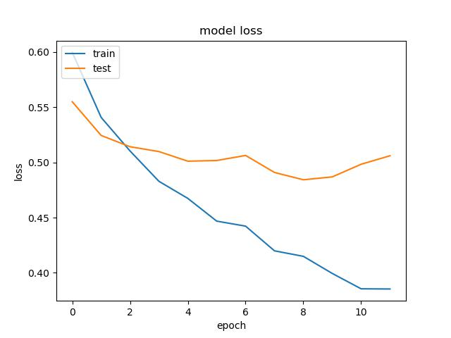

#### Shoulder
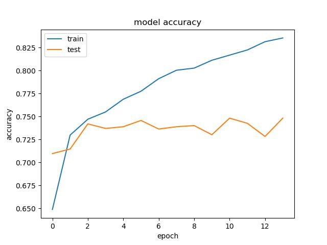 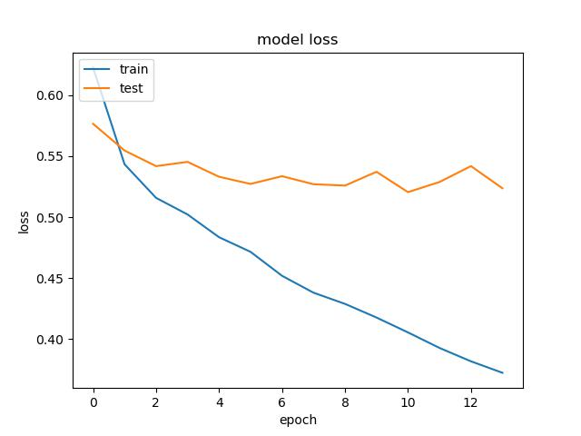

# Installations
### PyCharm IDE
### Python v3.7.x
### Install requirements.txt

* customtkinter~=5.0.3
* PyAutoGUI~=0.9.53
* PyGetWindow~=0.0.9
* Pillow~=8.4.0
* numpy~=1.19.5
* tensorflow~=2.6.2
* keras~=2.6.0
* pandas~=1.1.5
* matplotlib~=3.3.4
* scikit-learn~=0.24.2
* colorama~=0.4.5

Run mainGUI.Py

# GUI
### Main
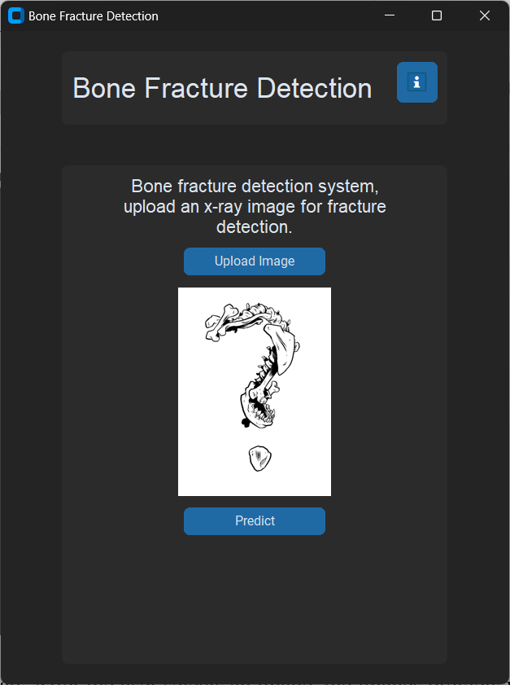

### Info-Rules
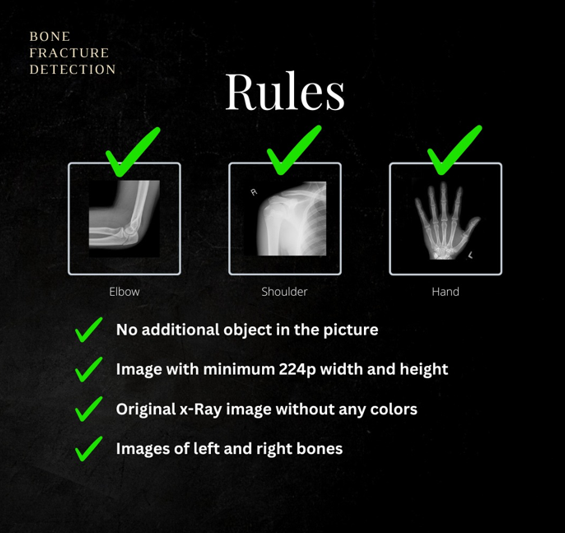

### Test Normal & Fractured
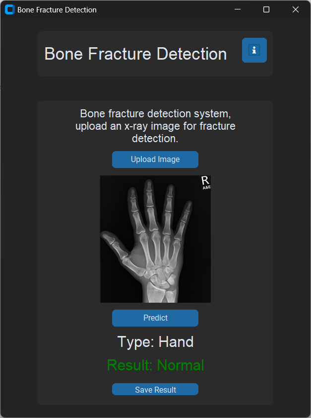 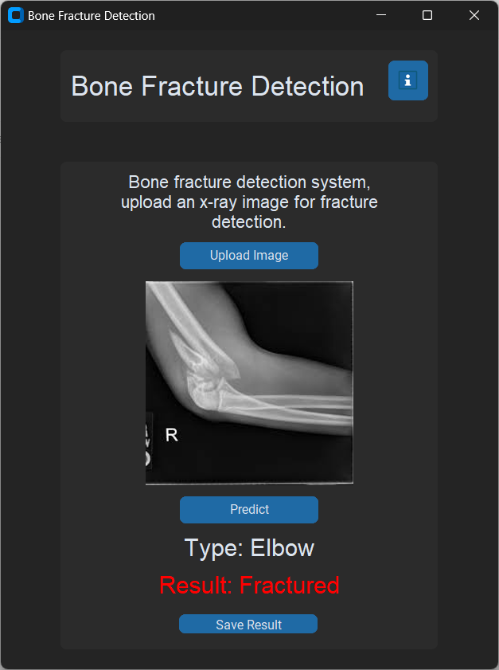

