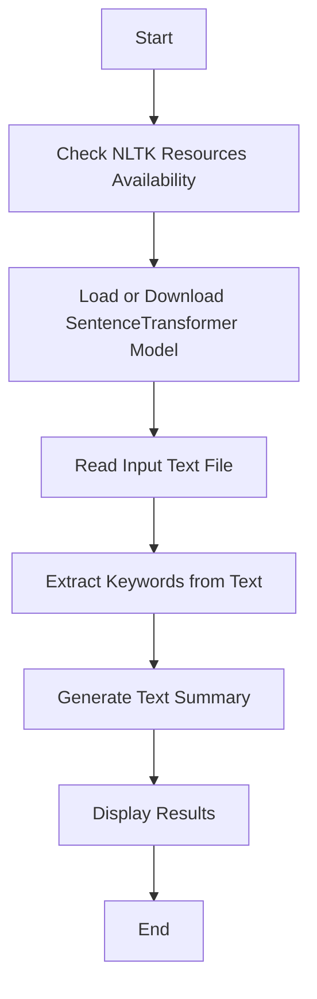

# NLP Natural Language Processing

Natural Language Processing (NLP) is a field of machine learning that focuses on the interaction between computers and humans through natural language. It involves teaching machines to understand, interpret, and generate human language in a way that is both meaningful and useful. NLP combines computational linguistics with statistical, machine learning, and deep learning models to process and analyze large amounts of natural language data.

## Workflow Diagram

## Steps and Processes

### 1. Ensure NLTK Resources are Available
- The script ensures that necessary NLTK resources are downloaded and available for use.

### 2. Load or Download SentenceTransformer Model
- The script loads the SentenceTransformer model from a local directory or downloads it if not available.

### 3. Read Input Text File
- The script reads the input text file named `input.txt` from the current directory.

### 4. Extract Keywords from Text
- The script extracts the top N keywords from the given text using word frequency and importance scores.

### 5. Generate Text Summary
- The script summarizes the given text by selecting the top N most important sentences based on cosine similarity.

### 6. Print Results
- The script prints the extracted keywords and the generated summary.

## Functions

- **load_or_download_model()**: Loads the SentenceTransformer model from a local directory or downloads it if not available.
- **download_nltk_resources()**: Ensures that necessary NLTK resources are downloaded and available.
- **extract_keywords(text, model, top_n=10)**: Extracts the top N keywords from the given text using word frequency and importance scores.
- **summarize_text(text, model, num_sentences=3)**: Summarizes the given text by selecting the top N most important sentences based on cosine similarity.
- **main()**: Main function that ensures NLTK resources are available, loads the model, reads the input text file, extracts keywords, generates a summary, and prints the results.

## Usage

- Ensure that the input text file `input.txt` is present in the current directory.
- Run the script to extract keywords and generate a summary of the text in `input.txt`.

### Online Resources
- **NLTK Documentation**: [NLTK Documentation](https://www.nltk.org/documentation.html) provides comprehensive information on how to use the NLTK library for various NLP tasks.
- **SentenceTransformers Documentation**: [SentenceTransformers Documentation](https://www.sbert.net/docs/) offers detailed guides and examples on how to use the SentenceTransformers library for sentence embeddings and other NLP applications.
- **Kaggle**: [Kaggle](https://www.kaggle.com/) is a platform for data science competitions and datasets, where you can find numerous NLP datasets and projects.
- **Towards Data Science**: [Towards Data Science](https://towardsdatascience.com/) is a Medium publication with articles and tutorials on NLP and other data science topics.
- **Hugging Face**: [Hugging Face](https://huggingface.co/) provides a wide range of NLP models and datasets, along with an active community and resources for learning and collaboration.

### Libraries
- **spaCy**: [spaCy](https://spacy.io/) is an open-source library for advanced NLP in Python, designed for production use.
- **Gensim**: [Gensim](https://radimrehurek.com/gensim/) is a library for topic modeling and document similarity analysis.
- **Transformers**: [Transformers](https://huggingface.co/transformers/) by Hugging Face is a library for state-of-the-art NLP models, including BERT, GPT-3, and more.
- **TextBlob**: [TextBlob](https://textblob.readthedocs.io/en/dev/) is a simple library for processing textual data, providing a consistent API for diving into common NLP tasks.
- **CoreNLP**: [CoreNLP](https://stanfordnlp.github.io/CoreNLP/) by Stanford NLP Group is a suite of NLP tools that provide various linguistic analysis tools.
- **Flair**: [Flair](https://github.com/flairNLP/flair) is a simple framework for state-of-the-art NLP, developed by Zalando Research.

These resources and libraries can help you further enhance your NLP projects and stay updated with the latest advancements in the field.
