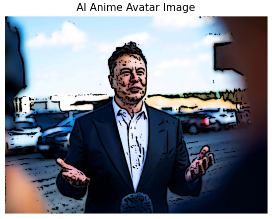

# 🤖 AI Anime Avatar Generator using OpenCV and Matplotlib 

This repository contains a Python script to transform any given image into a smooth, anime-like avatar with soft edges, vibrant colors, and smooth shading transitions. The effect is inspired by traditional anime art styles. The project uses OpenCV and Matplotlib for image processing and display.

## 🛠️ Features
- Load an image from a file and display it in RGB format.
- Apply a smoother, more anime-like effect with soft edges and vibrant colors.
- Use Gaussian blurring, adaptive thresholding, and bilateral filtering to create the effect.
- Boost saturation and brightness to mimic anime-style vibrancy.
- Display the original image and the cartoonized image side by side.

## 🎯 Prerequisites

Make sure you have Python 3.x installed. You'll also need the following Python libraries:

```bash
pip install numpy opencv-python matplotlib
```
## 🚀 How to Use
- Clone the repository:

```bash
git clone https://github.com/yourusername/anime-avatar-generator.git
cd anime-avatar-generator
```
- Replace the image path in the generate_anime_avatar()
 - function with the path to your image file.


- Run the Python script:
```bash
python anime_avatar_generator.py
```
Your anime-like avatar will be displayed side-by-side with the original image.

## 📁 Code Overview
- This project includes the following key functions:

#### Load Image: 
This function loads an image from a file and converts it into the RGB format that is compatible with the OpenCV and Matplotlib libraries. The image is then passed on to the next function for further processing.

#### Smooth Anime Effect: 
This function is the core of the anime avatar transformation. It applies several filters and transformations, including Gaussian blurring for smoother shading, adaptive thresholding for soft edges, and bilateral filtering for enhancing the vibrancy of the colors. These techniques create the anime-like style that combines soft shading transitions and vibrant hues.

#### Display Images: 
The final step involves displaying the original image and the cartoonized (anime-like) avatar side by side using Matplotlib. This helps in visually comparing the original with the modified version.

## 📸 Example
- Here’s an example of how an input image would be transformed into an anime-like avatar.

#### Input Image:
<div align="center"> </div>

#### Output Image:
<div align="center"> </div>

## 🤖 Technology Stack
- This project is built using the following technologies:

##### Python: 
The primary programming language for this project, known for its simplicity and a wide range of image processing libraries.
##### OpenCV: 
A powerful open-source computer vision library that provides easy-to-use tools for image transformations and filters.
##### NumPy: 
A fundamental library for scientific computing in Python, used for handling image arrays and numerical operations.
Matplotlib: A popular Python library for visualizing data. Here, it is used to display the images before and after processing.
## 💡 Inspiration
- The concept of cartoonizing or applying anime-like effects to real-life images has been inspired by the popularity of anime and animated media across the world. People enjoy seeing themselves or their friends as animated characters, and with modern image processing libraries, it's possible to recreate similar effects programmatically.

## 🧩 Possible Future Enhancements
###### Here are some ideas for extending the current functionality of the anime avatar generator:

 - Add support for multiple cartoon styles (e.g., Western comic style, watercolor style).
 - Implement a web interface using Flask or Streamlit for easy image uploads and processing.
 - Add more filters and effects for customization (e.g., background color changes, overlay effects).
 - Export the final anime avatar as a PNG or SVG file, making it easier to use on websites, profiles, or as avatars on social media.
 - Integrate the project with popular social media platforms for instant sharing of generated avatars.
## ⚡ Performance Optimizations
- Processing high-resolution images may take longer and consume significant memory. To optimize performance:

- Use multithreading to speed up the filtering process.
- Implement image resizing before processing to reduce the workload on your system.
- Consider implementing GPU acceleration with libraries like CuPy or CUDA.
## 🧰 Troubleshooting

- Common Issues:
No Module Named ‘cv2’ Error:

- If you encounter this error, it means the OpenCV library is not installed correctly. Make sure to install it using pip install opencv-python.
Image Not Displaying Properly:

- Ensure the image path is correct, and the image file is in a supported format (e.g., PNG, JPG).
- Slow Processing:
Large images may take longer to process due to the multiple filters being applied. You can try reducing the image resolution before applying the anime effect.

## 📜 License

- This project is licensed under the MIT License. You are free to use, modify, and distribute this code as long as you include a copy of the license with your project. For more details, see the LICENSE file.

